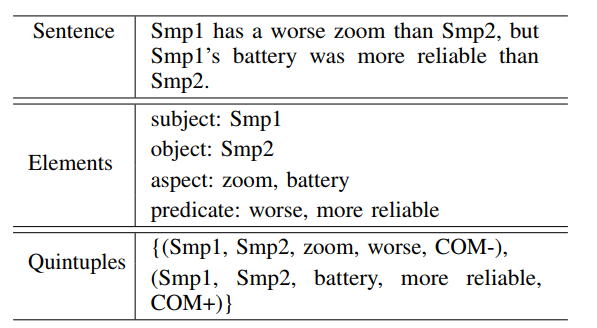
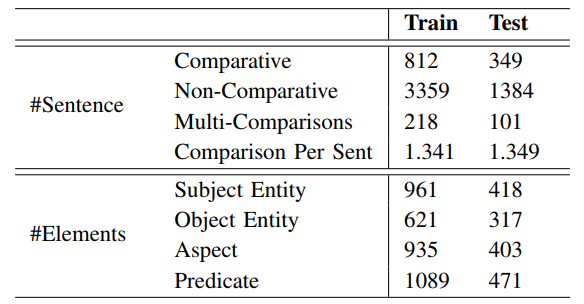
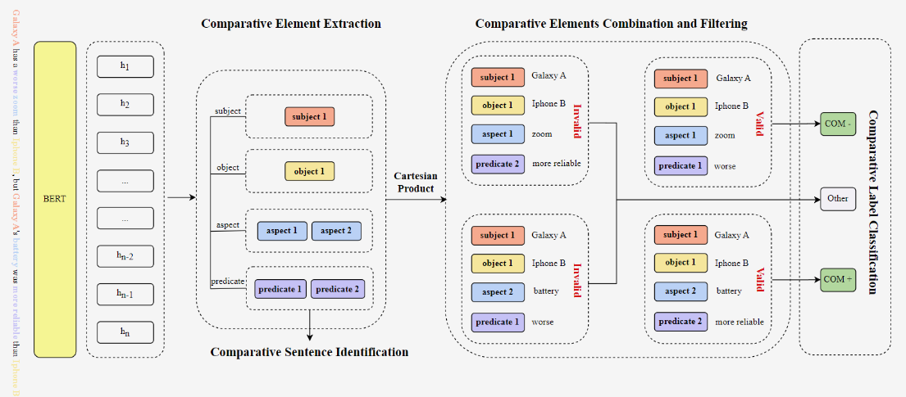
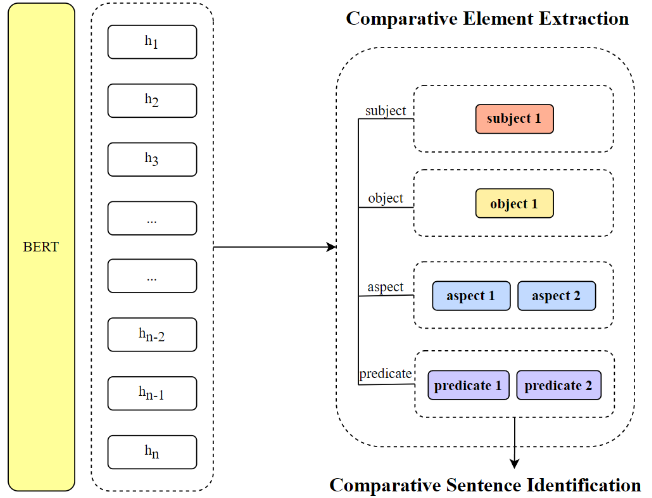
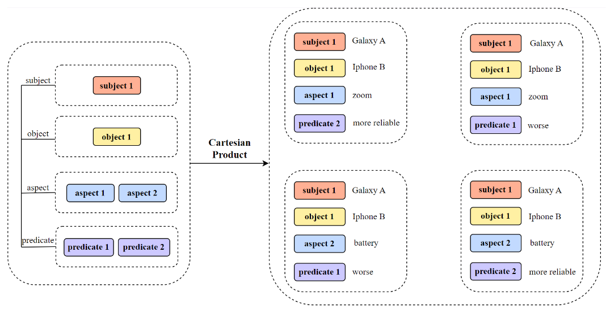
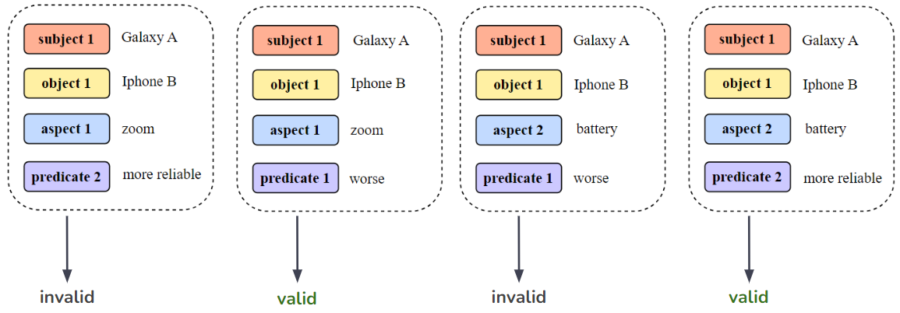
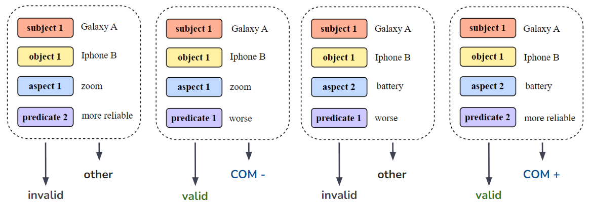
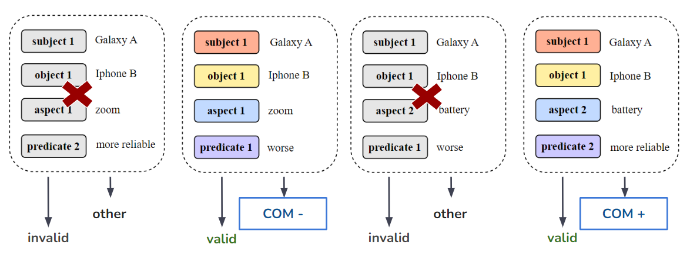

# Baseline model for VLSP 2023 ComOM Shared Task

## Task
This task aims to create models that can find opinions from product reviews. Each review has sentences that compare different parts of products.

## Dataset
The dataset is released by VLSP 2023 challenge on
Comparative Opinion Mining from Vietnamese Product
Reviews. Each review contains comparative sentences,
and the corresponding quintuples are annotated.
The following table shows the statistics of the comparative quintuple corpora.

## Approach
### Overall Architecture

### Stage 1: Comparative Element Extraction + Comparative Sentence Identification

### Stage 2, 3: Combination, Filtering + Comparision Label Classification
**Combination**

**Filtering**

**Comparision Label Classification**

**Output**

